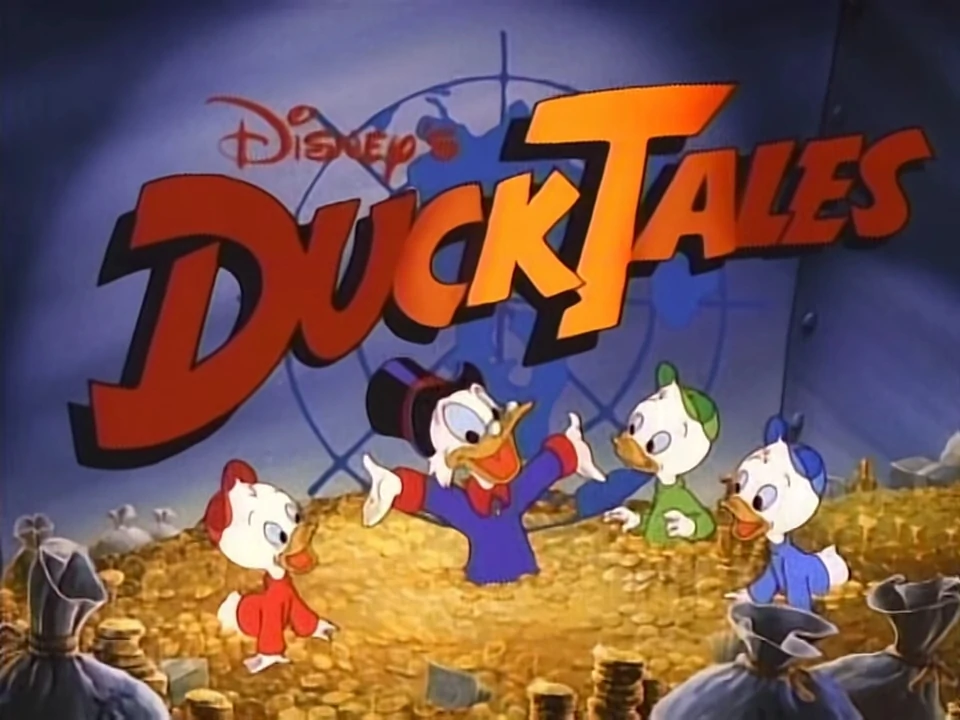

# ICG Projekt von Gruppe 01
<!-- Ein Bild der Anwendung muss im Ordner ./img relativ zu dieser Datei liegen -->



Dieses Repository beinhaltet das Projekt des Kurses  "Interaktive Computergraphik" von < Katrin Stötter, Lias Rieder und Lina Seyfried >. 

# Projekt Struktur
<!-- Ihr könnt die Projektstruktur beliebig beschreiben. Hier einfach mit dem Unix Programm `tree`  -->

```
.
├── README.md
├── dist
│   ├── index.html
│   ├── src
│   └── textures <-- Texturen
├── ...
├── img <-- Dokumentation
│   └── screenshot.png
├── obj <-- OBJ Dateien
├── src
│   ├── abgabe.ts <-- Boilerplate 
│   ├── ...
│   ├── loader  <-- shader loader
│   ├── math <-- Mathe Bibliothek
│   ├── parser <-- OBJ Parser
│   ├── renderers 
│   ├── saveload.ts <-- Laden / Speichern
│   └── scene  <-- Szenengraph
│       ├── ...
│       ├── camera.ts
│       ├── ...
│       ├── interaction.ts
│       ├── sceneUtils.ts
│       └── visitors <--  Visitors
└── ...

```

Das Projekt ist in mehreren Ordner thematisch aufgeteilt. 
`dist` beinhaltet Ressourcen die im Browser direkt verwendet werden. In `obj` liegen Beispieldateien, welche durch unseren OBJ Loader in die Szene geladen werden können. 
Unter `src` sind alle Quelldateien zusammengefasst, welche durch `webgl` transpiliert werden.
Hierbei haben wir die Pakete entsprechend ihren Funktionen strukturiert:
- `scene`  umfasst die Datenstrukturen für Szene und deren Interaktion
- ...
- ...

# Installation

Wechseln Sie mit einer Konsole in das Verzeichnis dieser Datei und füren Sie 

```
npm install
```
aus.
### Ausführung
Geben Sie anschließend 
```bash
npm start
```
eingeben und rufen die Website des Servers über to `0.0.0.0:<port>` bzw. `localhost:<port>` im Browser aufrufen. Der Port ist hierbei aus der Ausgabe der Konsole zu ersetzen.


# How-To

Im folgenden wird erklärt wie die Anwendung zu bedienen ist:

## Free Flight Modus

Um zwischen Fester Kamera und Free Flight Modus zu wechseln ...

## Beleuchtungsparameter

Die Slider auf der rechten Seite des Bildes von oben  ... 

### Funktionen 

<!-- replace  "- [ ]" with "- [X]" when you tackled the topic -->
| Nummer | Punkte | Beschreibung                                                     | bearbeitet               | Verantwortliche/r                    | Bewertung |
| ------ | ------ | ---------------------------------------------------------------- | ------------------------ | ------------------------------------ | --------- |
| M1     | 5      | Szenengraph                                                      | <ul><li>- [X] </li></ul> | Lina              |           |
| M2     | 10     | Rasteriser & Ray Tracer                                          | <ul><li>- [X] </li></ul> | Katrin, Lisa  Gans              |           |
| M3     | 3      | min. drei eingebundene Objekte                                   | <ul><li>- [X] </li></ul> | Lisa Duck                           |           |
| M4     | 8      | min. drei verschiedene Animationsknoten                          | <ul><li>- [X] </li></ul> | Lisa Duck                           |           |
| M5     | 4      | texturierte Objekte                                              | <ul><li>- [X] </li></ul> | Katrin, Lina Gans                          |           |
| M6     | 5      | mathematische Bibliothek                                         | <ul><li>- [X] </li></ul> | Katrin, Lina, Lisa Karlo             |           |
| M7     | 4      | Phong WebGL Shader (Rasterisier)                                 | <ul><li>- [X] </li></ul> | Katrin Gans                          |           |
| M8     | 2      | 3D-Anwendungsfenster                                             | <ul><li>- [X] </li></ul> | Lina, Katrin Karlo             |           |
| M9     | 4      | Taskleiste                                                       | <ul><li>- [X] </li></ul> | Lina, Katrin Gans                          |           |
| M10    | 5      | Mausklick mit Manipulation                                       | <ul><li>- [X] </li></ul> | Lina Karlo                          |           |
|        |        |                                                                  |                          |                                      |           |
| O1     | 7      | weitere Texturen zur beeinflussung der Beleuchtung / Transparenz | <ul><li>- [] </li></ul> |                
  |           |
| O2     | 3      | Videos und Text als Textur                                       | <ul><li>- [X] </li></ul> | Lina Karlo                          |           |
| O3     | 8      | Laden von 3D Modellen                                            | <ul><li>- [ ] </li></ul> |                                      |           |
| O4     | 4      | mehrere Lichtquellen                                             | <ul><li>- [X] </li></ul> | Katrin Karlo                          |           |
| O5     | 6      | Lupeneffekt                                                      | <ul><li>- [] </li></ul> | 
                |           |
| O6     | 4      | Animation bei Klick                                              | <ul><li>- [X] </li></ul> | Lina
   |           |
| O7     | 8      | Kamera Knoten                                                    | <ul><li>- [] </li></ul> |  Lisa                                   |           |
| O8     | 5      | Beschleunigung des Raytracing                                    | <ul><li>- [X] </li></ul> | Lina                          |           |
| O9     | 8      | Laden & Speichern                                                | <ul><li>- [X] </li></ul> | Katrin                                 |           |
| O10    | 7      | Raytracing aller Dreiecksnetze                                   | <ul><li>- [X] </li></ul> | Katrin                          |           |
| O11    | 10     | Dynamische Texturen                                              | <ul><li>- [] </li></ul> |             |           |
| O12    | 5      | Anwendung in den 3D Anwendungsfenstern                           | <ul><li>- [X] </li></ul> | Katrin                                  |           |


### Kompatibilität
Das Projekt wurde mit folgenden Konfigurationen getestet:
<!-- Nur die Konfigurationen angeben die ihr wirklich getestet habt. Eine gängige Kombination ist hier schon ausreichend-->
- Windows 10 Build Version <> mit
  - Firefox Version <>
  - Chrome Version <> 
  - Edge Version - nein
  - Internet Explorer - nein 
  - node js Version <>
<!--
- Manjaro Build Version <> mit
  - Firefox Version <>
  - Chrome Version <> 
  - Opera Version <>
  - Chromium Version <>
  - node js Version <> 
- macOs Build Version <> mit
  - Firefox Version <>
  - Chrome Version <> 
  - Safari Version <>
  - Chromium Version <>
  - node js Version <>
-->
