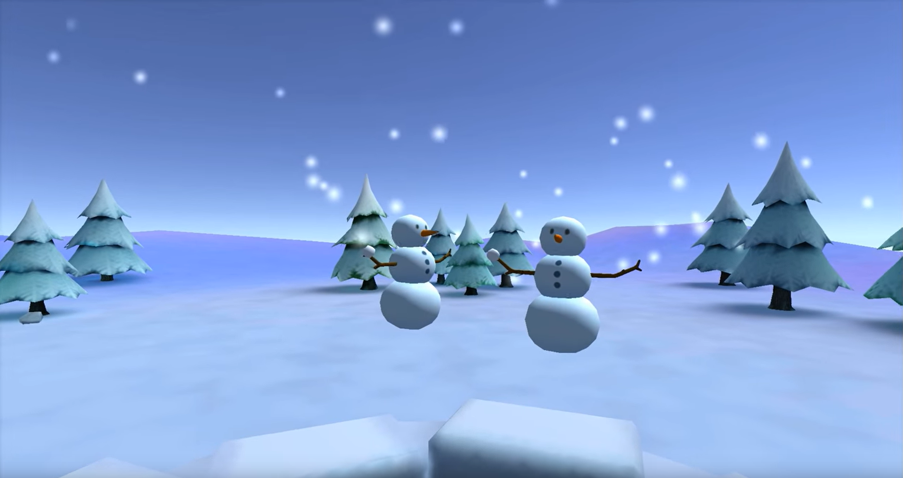

---
title: "Finale Abgabe: Informatik Bachelor, Games Engineering Bachelor, Computational Mathematics"
---
## Allgemeine Beschreibung

Ziel der Aufgabe ist das Entwickeln einer Typescript Webanwendung, welche die in der Veranstaltung Interaktive Computergraphik gelernten Inhalte umsetzt. Dies bezieht sich insbesondere auf die folgenden Themengebiete:

* Szenengraph
* Beleuchtungsmodelle
* Materialien
* Softwarebibliothek für Lineare Algebra
* Interaktivität

## Prüfungstermine

Die Prüfungen finden an den Tagen **19.09.2022 - 23.9.2022** statt. Für den Fall, dass mehr Studenten die Prüfung ablegen wollen als Termine zur Verfügung stehen, werden zusätzliche Prüfungstage nach den genannten Terminen eingerichtet.

Weitere Details zu den Prüfungsterminen werden über WueCampus angekündigt.

## Abgabe

Das Ergebnis des Projekts ist bis zum **16.09.2022**, 23:59 Uhr einzureichen. Zu diesem Zweck ist es in einer lauffähigen Variante auf den [GitLab Server des Instituts für Informatik](https://gitlab2.informatik.uni-wuerzburg.de/) hochzuladen. Alternative Abgabewege sind nicht zulässig.

## Projektbeschreibung

Das Thema des zu implementierenden Programms ist Ballwurfspiel. Animierte Ziele sollen mit einer Kugel abgeworfen werden können.
Die abzuwerfenden Ziele bestehen sowohl aus geometrischen Primitiven wie Pyramiden und Würfeln, sowie komplexen Geometrien.

Die Wurfstärke ist abhängig von der Dauer des Maustastendrucks. Die Flugrichtung entspricht zunächst einer Geraden.

Die Spielparameter sollen mittels Buttons und Slider auf der HTML Seite zur Laufzeit geändert werden können. Die Abgabe erfolgt in Gruppen aus maximal 3 Mitgliedern.

Die Abgabe geschieht über ein Repository, das auf Anfrage bis spätestens 22.07.2022 zugewiesen wird.
Sollte zum Zeitpunkt der Anfrage kein Account mit angegebenem Namen auf dem Gitlab Server existieren kann kein Repository zugewiesen werden. Sollte der Fall auftreten muss der Account angelegt werden und eine neue Anfrage gestellt werden. Der Zugriff auf das Abgaberepository wird nach der Abgabefrist entzogen.
Der Commit der finalen Abgabe ist kenntlich zu machen (taggen). Wird das taggen versäumt kann der Prüfer einen arbiträren Stand des git Repositories zur Prüfung verwenden. "Taggen" bezieht sich dabei auf die gleichnamige Git Funktionalität und ist nicht mit einer besonderen Benennung einer Git commit Beschreibung gleichzusetzen.

**Das Projekt muss auf einem aktualisierten System (Windows, macOS, Linux-Distribution) mit aktueller Software oder neuesten LTS Varianten lauffähig sein. Mindestens eine Konfiguration ist zu testen und ist mit der Abgabe zu dokumentieren.**

## Bewertung

Die Prüfung besteht aus der Projektpräsentation und einer Einzelbefragung.

Ist das abgegebene Programm nicht ohne Modifikationen lauffähig, so gilt das Projekt als nicht bestanden.

Zum Erreichen des Bonus müssen mindestens die *Allgemeinen Anforderungen* und die *Mindestvoraussetzungen* bestanden werden. Aus den *Erweiterungen* müssen mindestens 5 erfüllt werden.

### Projektpräsentation

Eine Projektpräsentation erfolgt über die Dokumentation des Repoitories. Eine Readme Datei und das  Wiki des Gitlab Projektes dokumentiert Ihren  Projektfortschritt und Ihre Abgabe. Es muss ersichtlich werden, wie ihre Abgabe strukturiert ist, sowie  wie das Programm verwendet (installiert und bedient) werden kann. 

### Einzelbefragung

Jedes Gruppenmitglied wird einer Einzelbefragung während der Prüfung unterzogen. Die Einzelbefragung stellt sicher, dass sich jedes Gruppenmitglied aktiv an der Entwicklung des Projektes beteiligt hat.
Die Befragung fokusiert sich auf zentrale Aspekte der Projektimplementation.
Jedes Gruppenmitglied muss in der Lage sein durch den Programmcode des Projektes zu navigieren und Auszüge wie auch zugehörige Theorie auf die der Code aufbaut zu erklären.

## Projekt

Mindestvoraussetzung für das Bestehen des Projekts:

1. Die Anwendung muss eine Szenengraph Datenstruktur verwenden, um die 3D-Objekte der Szene hierarchisch zu verwalten. Die Inhalte der dargestellten Szene sind dabei so zu wählen, dass die Vorteile der Datenstruktur ersichtlich werden (Objekte werden in mindestens drei Hierarchiestufen relativ zueinander bewegt). Die Tiefe des Szenengraphen muss veränderbar sein (das Hinzufügen weiterer (Gruppen-) Knoten muss prinzipiell möglich sein).
2. Es müssen zwei Renderer unterstützt werden: Ein Raytracer und ein WebGL Rasterisierer. Beide müssen den Szenegraphen unter Verwendung des Visitor-Patterns traversieren um die Szene zu rendern. Der Raytracer darf alle Geometrieobjekte außer Kugeln beim Rendern ignorieren. Der aktive Renderer muss per Tastatureingabe gewechselt werden können.
3. Mindestens drei verschiedene Objektarten (z.B. Würfel, Kugel, Pyramide) müssen eingebunden sein.
4. Mindestens 3 verschiedenen Animationsknoten (Rotor - rotiert um eine Achse, Jumper - bewegt an einer Achse hin und her, Driver - bewegt entlang mindestens zweier Achsen als Reaktion zu Tastatureingaben) sind zu unterstützen. Mindestens zwei der Animationsknoten müssen vom Benutzer in geeigneter Form gesteuert werden können. Dabei sind mindestens Tastatureingaben zu unterstützen.
5. Die in der Anwendung angezeigten 3D Modell sollen jeweils mehr als eine Farbe haben können. Des Weiteren muss mindestens eines der Objekte muss mit einer Textur versehen sein.
6. Die für den Szenengraph notwendigen mathematischen Operationen müssen mit Hilfe einer Mathe-Library umgesetzt werden. Alle notwendigen mathematischen Operationen, die nicht von der Programmiersprache selbst unterstützt werden (d.h. ohne die Verwendung von zusätzlichen Bibliotheken), sind selbst zu implementieren. Es wird erwartet, dass Formeln nicht nur kopiert sondern auch verstanden wurden.
7. Es ist ein Shader-Programm zu schreiben, welches das Phong-Beleuchtungsmodell implementiert. Die Parameter des Beleuchtungsmodells sind dabei von der Typescript Anwendung zu verändern, z.B. sollen die Koeffizienten der einzelnen Terme des Beleuchtungsmodells zur Laufzeit des Programms modifiziert werden können. Mindestens eine bewegliche Lichtquelle muss unterstützt werden.
8. Überschneidungen zwischen animierten Kugeln und anderen Objekten ändern eine Eigenschaft des Objektes (z.B. Farbwert)

Für den Bonus wird zusätzlich die Implementierung von 5 der folgenden Erweiterungen verlangt:

* Mehrere Texturen als Parameter für den Shader-Knoten, die für ein weiteres Verfahren genutzt werden (z.B. zur Implementierung von Bumpmapping)
* Laden und Speichern einer Szene aus einer XML Datei (oder einem anderen geeigneten Format).
* Model Loader (z.B. OBJ-Format) zum Einlesen komplexerer Meshes.
* Kamera-Knoten als Bestandteil des Szenegraphen (inkl. Animation, z.B. Anhängen der Kamera an bewegtes Objekt)
* Mehrere (>=3) bewegte Lichtquellen-Knoten als Bestandteil des Szenegraphen.
* Free-Flight Modus (Kamerabewegung vor, zurück, links, rechts, aufwärts, abwärts Kamerarotation nicken, gieren)
* Animierte Wurfziele
* Pausieren der Spieleanimationen. Bewegen der Kamera soll weiterhin möglich sein.
* Parabelflug des Wurfobjektes
* Auswahl und Manipulation von Objekten per Maus. Die Implementierung muss einen Strahl in Abhängigkeit der Mausposition berechnen. Dieser soll per Schnittest das naheste Objekt berechnen.
## Erklärungen

Wenn Parameter des Beleuchtungsmodelles im Shader zur Laufzeit modifiziert werden können sollen, wird erwartet, dass die Parameter im Shader-Programm als `uniform` implementiert sind und von TypeScript-Seite geändert werden können. Es wird empfohlen, dass die HTML-Seite eine Änderung der Parameter mit Slidern/Buttons erlaubt. Es dürfen andere, geeignete, Modifikatoren verwendet werden.  

Mehrere Texturen für ein weiteres Verfahren zu verwenden bedeutet nicht, dass einfach die Farbinformationen zweier Texturen miteinander addiert, multipliziert oder ähnliches werden sollen. Die Aufgabenstellung fordert, dass eine zusätzliche Textur Werte enthält, die nicht direkt Farbwerten entsprechen. Das können z.B. Materialkoeffizienten des Phong-Beleuchtungsmodelles sein.

Knoten als Bestandteil des Szenegraphen bedeuten, dass diese auch wie ein Bestandteil des Szenegraphen verwendet werden. Knoten in die Datenstruktur einzubringen und dann dort zu ignorieren und sie so zu verwenden als wären sie komplett unabhängig des Szenegraphen erfüllt nicht die Anforderung. Knoten in einem Szenegraphen müssen die Transformationen der in der Hierarchie zuvorkommenden Knoten aufgreifen. Es wird weiterhin erwartet, dass alle Objekte in einem Renderlauf sich einheitlich verhalten. Weder Kamerainformationen noch Lichtinformationen sollen sich innerhalb des selben Renderlaufes für unterschiedliche Objekte unterschiedlich darstellen. Entsprechend ist es bei der Verwendung von Lichtquellen und Kamera im Szenegraphen notwendig deren Information in einer gesonderten Traversierung des Szenegraphen zu extrahieren bevor in einer weiteren Traversierung alle Objekte gerendert werden.

## **Fragen und Antworten**

**Thema**: Es müssen zwei Renderer unterstützt werden: Ein Raytracer und ein WebGL Rasterisierer.

**Frage**: Muss der Ray Tracer auch das Phong Beleuchtungsmodell implementieren?

**Antwort**: Ja.

**Frage**: Müssen beide Renderer alle Animationen unterstützen?

**Antwort**: Ja.

**Frage**: Müssen Texturen das Beleuchtungsmodell berücksichtigen

**Antwort**: Ja.

---

**Thema**: Mindestens 3 verschiedenen Animationsknoten (Rotor - rotiert um eine Achse, Jumper - bewegt an einer Achse hin und her, Driver - bewegt entlang mindestens zweier Achsen als Reaktion zu Tastatureingaben) sind zu unterstützen. Mindestens zwei der Animationsknoten müssen vom Benutzer in geeigneter Form gesteuert werden können. Dabei sind mindestens Tastatureingaben zu unterstützen.

**Frage**: Reicht es aus, Animationen per Tastatureingabe zu starten/stoppen?

**Antwort**: Ja, sofern diese eine geeignete Form der Manipulation darstellen. Für Verschiebungen und Rotationen kann eine konstanten Geschwindigkeit angenommen werden.

**Frage**: Sollen die Animationen für alle Objekte die diese Art von Animation haben gleichzeitig ausgeführt werden?

**Antwort**: Nein. Es können zwei Objekte mit Driver-Animation in der Szene vorhanden sein, die mit unterschiedlichen Tasten bedient werden.

**Frage**: Animationen wie Jumper sind mit der Anforderung der Mausinteraktion offensichtlicher zu implementieren. Wenn diese Anforderung nicht implementiert wird, wie sollen die Animationen in der Anwendung eingbaut werden?

**Antwort**: Die Objekte, welche von der Animation manipuliert werden, können auch von Anfang an zu sehen sein, und deren Anordung im Szenengraph fest angeommen werden.

---

**Thema**: Die in der Anwendung angezeigten 3D Modell sollen jeweils mehr als eine Farbe haben können. Des Weiteren muss mindestens eines der Objekte muss mit einer Textur versehen sein.

**Frage**: Muss eine Kugel auch mehrere Farben unterstützen?

**Antwort**: Nein, Kugeln bilden hier eine Ausnahme. Die aus den Übungen bekannte Implementierung erwartet eine einzelne Farbe. Diese darf übernommen werden. Alle anderen sichtbaren Objekte müssen mehrere Farben unterstützen. **Das gilt ebenso für optionale Objekte wie Mesh-Körper.**

**Frage**: Erfüllt ein Würfel mit unterschiedlichen Farben pro Seite die Anforderung oder muss jeder Punkt des Netzes eine eigene Farbe bekommen?

**Antwort**: Ja, für einen Würfel ist die Farbvergabe pro Seite gut geeignet.

**Frage**: Müssen mit dem Raytracer gerenderte Kugeln auch (mehrere) Texturen oder mehr als eine Farbe unterstützen?

**Antwort**: Nein Kugeln dürfen als einfarbig angenommen werden. Sie sind auch die einzigen Objekte die der Raytracer darstellen muss.

**Frage**: Ist ein bestimmtest Muster wie ein Farbverlauf gefordert wie es bei Dreiecken mit unterschiedlichen Eckfarben üblich ist gefordert?

**Antwort**: Nein. Es muss lediglich eine **beabsichtigte, kontrollierbare und nachvollziehbare Modifikation** von einer einzelnen Objektfarbe weg sein.

---

**Thema**: Mehrere Texturen als Parameter für den Shader-Knoten, die für ein weiteres Verfahren genutzt werden (z.B. zur Implementierung von Bumpmapping)

**Frage**: Gelten je eine Textur auf einer Seite eines Objektes als Erfüllug der Anforderung?

**Antwort**: Nein. Es muss ein weiteres Verfahren genutzt werden. Das Verwenden von Texturen als Objektfarbe enspricht nur ein genutzes Verfahren.

---

**Thema**: Auswahl und Manipulation von Objekten per Maus. Die Implementierung muss einen Strahl in Abhängigkeit der Mausposition berechnen mit welchem das ausgewählte Objekt per Schnittpunktberechnung mit seiner Bounding Sphere bestimmt wird.

**Frage**: Ist ein Farb-/Texturwechsel bei Klick eine ausreichende Manipulation?

**Antwort**: Ja

**Frage**: Reicht es aus, das Objekt durch einen Strahl Kugel Schnitt zu bestimmen?

**Antwort**: Nein. Der Strahl Kugel Schnitt mit einer Bounding Sphere erspart lediglich teure Berechnungen mit vielflächigen Körpern die nicht getroffen werden. Sollte es einen Schnitt mit dem Hüllkörper geben, muss mit dem Objekt selbst der Schnitttest ausgeführt werden.

---

**Thema**: Laden und Speichern einer Szene aus einer XML Datei (oder einem anderen geeigneten Format).

**Frage**: Reicht es aus, wenn die Datei lokal im Browser gespeichert wird?

**Antwort**: Nein. Die Datei soll extern gespeichert, dort bearbeitet werden und wieder geladen werden können. Extern bedeutet hierbei auf einem durch den Benutzer angegebenen Pfad.

**Frage**: Ist es notwendig, sofern die Anforderung "Auswahl und Manipulation von Objekten per Maus" auch erfüllt wird, die Manipulation mit zu laden/speichern?

**Antwort**: Ja.

**Frage**: Müssen Modifikationen der Szene und Parameter korrekt gespeichert und geladen werden?

**Antwort**: Ja.

---

**Thema**: Model Loader (z.B. OBJ-Format) zum Einlesen komplexerer Meshes.

**Frage**: Woher müssen die Modelle geladen werden?

**Antwort**: Dazu gibt es keine Vorgabe. Das Modell kann aus einer Datei stammen oder auch deren Inhalt schon im Quelltext als Variable fest enthalten sein. Der Loader bezieht sich auf das Verarbeiten der textuellen Repräsentation.

**Frage**: Dürfen externe Bibliotheken für das Aufbauen der Objekte verwendet werden?

**Antwort**: Nein. Der Model Loader erhällt als Eingabe den Dateiinhalt als Zeichenkette und produziert einen Geometrieknoten. Alle Teilschritte sollen selbstständig implementiert werden. Die Modelle dürfen jedoch selbst gewählt werden. Diese müssen im Repository beigelegt sein.

**Frage**: Das OBJ Format speichert Farbinformationen in einer seperaten Datei. Wenn OBJ als Dialekt gewählt wird, müssen auch Farben geladen werden können?

**Antwort**: Nein. Die Anforderung der Mehrfarbigkeit kann auch anders erfüllt werden.

**Frage**: An welche Stelle im Graphen soll das Modell eingefügt werden?

**Antwort**: Hierzu gibt es keine Anforderung. Dieses darf an einem vordefinierten Knoten angehängt werden.

**Frage**: Müssen die entstandenen Mesh-Körper Texturen unterstützen?

**Antwort**: Nein.

**Frage**: Müssen die entstandenen Mesh-Körper beim Laden und Speichern inklusive Modifikation korrekt wiedergegeben werden ?

**Antwort**: Ja.

---

**Thema**: Mehrere (>2) bewegte Lichtquellen-Knoten als Bestandteil des Szenegraphen.

**Frage**: Ist die Anzahl der Lichtquellen als variabel über die Ausführungsdauer des Programms anzunehmen?

**Antwort**: Ja. Es darf jedoch von maximal 8 Punktlichtquellen ausgegangen werden.

**Frage**: Müssen Lichtquellen im Szenengraph enthalten sein und somit auch jegliche Animation unterstützen / per Eigabe steuerbar sein?

**Antwort**: Ja.

---

**Thema**: Free-Flight Modus (Kamerabewegung vor, zurück, links, rechts, aufwärts, abwärts Kamerarotation nicken, gieren)

**Frage**: Muss die Position und Orientierung des Betrachters berücksichtigt werden, wenn die Kamera nicht als Teil des Szenengraphs implementiert wird und zwischen den Renderern gewechselt wird?

**Antwort**: Ja.

**Frage**: In welchem Koordinatensystem sollen die Transformationen der Kamera angewandt werden?

**Antwort**: Die Transformationen beeinflussen die Position und Orientierung relativ zur gesammten Szene. Das ist die Definition der View Matrix.

---

**Thema**: Ziel der Aufgabe ist das Entwickeln einer Typescript Webanwendung, welche die in der Veranstaltung Interaktive Computergraphik gelernten Inhalte umsetzt.

* Szenengraph
* Beleuchtungsmodelle
* Materialien
* Softwarebibliothek für Lineare Algebra
* Interaktivität

**Frage**: Darf bei Teilen dieser Anforderungen auf Bibliotheken wie three.js zurückgegriffen werden?

**Antwort**: Nein. Für alle vorlesungsrelevaten Inhalte muss die Implementierung durch die Gruppenmitglieder erfolgen. Funktionen von WebGL und Typescript dürfen verwendet werden.

**Frage**: Müssen Materialien (z.B. Texturen) das Beleuchtungsmodell berücksichtigen

**Antwort**: Ja.

**Frage**: Müssen die Beleuchtungsparameter im Szenengraph gespeichert werden?

**Antwort**: Nein, jedoch wird dieses empfohlen um das Umschalten zwischen den Renderern zu vereinfachen.

---

**Thema**: Der Commit der finalen Abgabe ist kenntlich zu machen (taggen). Wird das taggen versäumt kann der Prüfer einen arbiträren Stand des git Repositories zur Prüfung verwenden. "Taggen" bezieht sich dabei auf die gleichnamige Git Funktionalität und ist nicht mit einer besonderen Benennung einer Git commit Beschreibung gleichzusetzen.

**Frage**: Welches Kürzel soll verwendet werden?

**Antwort**: "final"

---

**Thema**: Es ist ein Shader-Programm zu schreiben, welches das Phong-Beleuchtungsmodell implementiert. Die Parameter des Beleuchtungsmodells sind dabei von der Typescript Anwendung zu verändern

**Frage**: Müssen die Beleuchtungsparameter auch wärend der Ausführung über die Web-Oberfläche veränderbar sein?

**Antwort**: Ja. Diese sollen analog zu den Beleuchtungsparametern in der Übung veränderbar sein.

---

**Thema**: Beispiele von Auswirkungen für das Nichterfüllen einer Anforderung

**Die Mindestvoraussetzungen müssen implementiert sein, verwendet werden und mindestens ansatzweise **funktionieren. Wenn Teile davon gar nicht vorhanden sind oder überhaupt nicht funktionieren, folgt das Nicht-Bestehen des Projektes.**

Konkrete Beispiele für Punktabzug:

* Der Rastervisitor rendert Kugeln im Randbereich nicht richtig
* Der Rayvisitor multipliziert die Matrizen falsch und alle Kugeln liegen ineinander. (Der Szenengraph ist jedoch richtig definiert)
* Das implementierte Phong Beleuchtungsmodell rendert nur den ambienten Teil richtig, da im Kreuzprodukt ein Fehler ist(Alle Teile des Modells werden jedoch ausgerechnet)
* drei Animationsknoten existieren aber der Rotor lässt das Objekt trotz richtiger Matrix wild durch die Szene springen statt das Objekt zu drehen

Konkrete Beispiele für fehlende Mindestanforderungen welche das Projekt erfolglos machen:

* nur zwei Animationsknoten sind implementiert oder verwendet, welche die Szene verändern
* Die Mindestanforderungen werden aus den Übungen nicht ins Projekt übernommen.
* Ein Visitor erzeugt beim Traversieren einen Laufzeitfehler und Anwendung rendert nur den ersten Frame richtig.
* Kein Objekt mit Textur in der Szene
* keine drei verschiedenen Objektarten bei der Rasterisierung verwendet
* Das Vorhandensein eines Szenengraphs aber nicht die konsequente Verwendung (z.B. das Speichern / Nutzen von Lichtquellen außerhalb des Graphen)
* Die Summe der Punkte aus Mindestanforderungen und optionalen Anforderung unterschreitet die Mindestbestehensgrenze.
